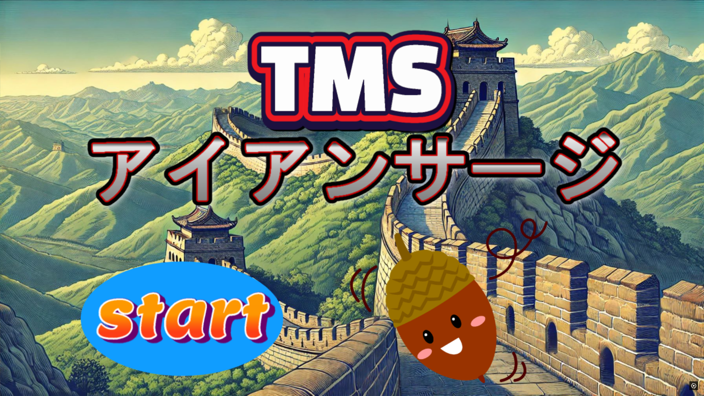

# 目次

# TMS-アイアンサージとは
このゲームは、UnityというゲームエンジンとMediaPipeという画像処理ライブラリを組み合わせて作りました！​

あなたの動きを読み取ってゲームが進行！体を動かして迫りくる壁を​

避けたり、ジャンプで破壊したりして進む全身運動型アクションゲーム！​
壁を避けて破壊して得点を稼ぎ、制限時間内にハイスコアを目指そう！​

# 準備
MediaPipeとUnityを用いて作成する
### MediaPipeの環境構築
### Python環境を構築
1. VSCodeのインストールを行う(デフォルト設定のまま次へを）
2. VSCodeの拡張機能をインストール(入れたい拡張機能を検索）
3. Pythonのインストール( 検索欄からPythonを使用するのでインストール)(PATHにチェックを入れ忘れない)
4. 
