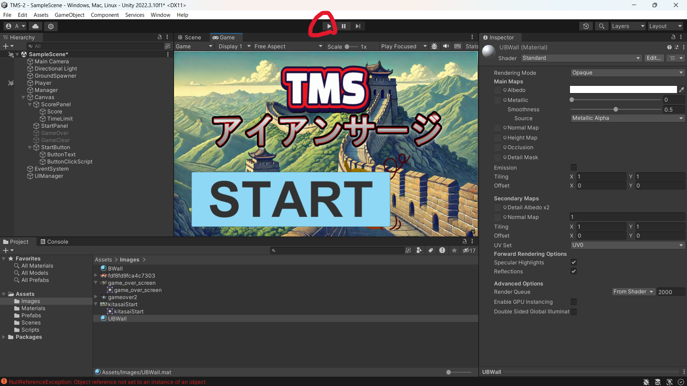

# TMS-アイアンサージとは
このゲームは、UnityというゲームエンジンとMediaPipeという画像処理ライブラリを組み合わせて作りました！​

あなたの動きを読み取ってゲームが進行！体を動かして迫りくる壁を​

避けたり、ジャンプで破壊したりして進む全身運動型アクションゲーム！​
壁を避けて破壊して得点を稼ぎ、制限時間内にハイスコアを目指そう！​


# 準備
githubのTMS-2リポジトリの中身をzipファイルにしてダウンロードする。


------------------
MediaPipeとUnityそれぞれで環境構築を行う
### MediaPipe
Python環境を構築
1. [VSCodeをインストール](https://code.visualstudio.com/download)
2. [Pyhton3.12.6をインストール](https://www.python.org/ftp/python/3.12.6/python-3.12.6-amd64.exe)(Pathにチェックを入れ忘れない）
3. Pythonの実行方法
- まず以下のライブラリをインストールしてください
  ```
  pip install tensorflow
  pip install tensorflow-hub
  pip install opencv-python
  pip install numpy
  ```

> [!TIP] 
>一度仮想空間を作成したことがあるならば以下のディレクトリに存在するキャッシュを削除してから
> コードを実行することをお勧めします
>
> C:\Users<ユーザー名>\AppData\Local\Temp\tfhub_modules\

### Unity
1.[Unity Hubをインストール](https://unity.com/ja/download)

2.[Unityをインストール](https://unity.com/ja/releases/editor/whats-new/2022.3.10)


# 実行方法
## VSCode側の操作
- VSCodeでoperation.pyを開いて右上にある再生ボタンを押して実行する。
  
- カメラが起動したらターミナル上でカメラのどこにいるか、ジャンプをしたかなどの判定が出ていたらOK

## Unity側の操作
- 以下のスタートボタンが出てくるまで画面サイズを変えてみる

- Unityの以下の部分を押してゲームを再生する。
  
- 再生が完了したら、ゲーム画面上のSTARTボタンにマウスカーソルを合わせクリック

> [!CAUTION]
> Playerの欄のDebug Playのチェックを外してください。チェックをつけたままだとカメラの読み込みでのキャラ操作ができません。
> チェックをつけると矢印キーとスペースキーで操作することが可能です。

# 遊び方
- 迫り来る壁を避ける
- 左に動くと左に、右に動くと右に、ジャンプするとその場でジャンプが出来る。
- 左右への移動やジャンプの特定の動作を行い、壁を避けることで得点が加算される。
- 制限時間90秒を耐えるとゲームクリア
- 壁にぶつかるとゲームオーバーとなる

## Author
奥田　達矢

草田　真生

矢野　翔太郎
